 

## 🛠️ Skills

### 💬 Languages

  

### 🤖 AI / LLM Engineering

  
    
  
  
  
  
  
  
  
  
  
  

### 🗄️ Retrieval & Databases

  
    
  
  
  
  

### ⚙️ Backend

  
    
  

### 🎨 Frontend

  

### 🧰 DevOps & Tools

  

## 📊 Analytics

  
  

  

  

  

  

## 🤝 Let's connect

 

  

